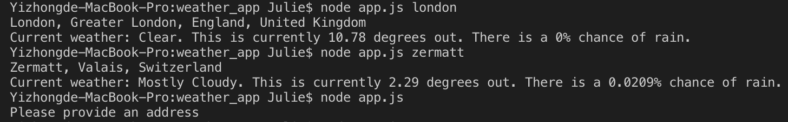

# Weather app

Pratice Nodejs with asynchronous model.

Gets input of location from the user and fetches the weather forecast. 

It will later on be connecting to a frontend web page. 

## To install and run the code

1. Fork the repo
2. Run `$ npm install`
3. Run commands in terminal

## To interact with the code:

Run `$ node app.js location`
(Replace location with anywhere you want)

See the example:

### Sign up for api keys
- Weather API: Go to http://darksky.net/dev
- Geocoding API: Go to https://www.mapbox.com/

## Tools
npm request